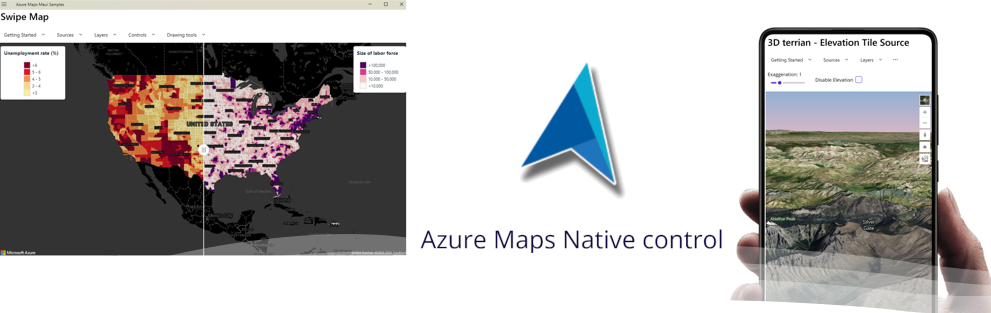

# Azure Maps .NET Map Control

> [!WARNING]  
> This is not an official Microsoft project. This was originally created as a hackathon project as an experiment. Unless others are interested in contributing, I may not maintain this project long term. 

This project is a .NET wrapper for the Azure Maps Web SDK. It is designed to be used in .NET MAUI, WinUI, and WPF applications. 
The goal of this project is to provide a .NET map control that has nearly all the same features and capabilities of the Azure Maps Web SDK with a similar API interface. 
Well over 95% of the core Azure Maps capabilities and many modules are exposed in this solution. 

> [!NOTE]
> This library is designed for performance and purposely supports a limited amount of data binding. 
> When loading the map you can set initial options in XAML but these will only be used when initializing the map and will not be used or updated after initialization.
> Most of these settings can be updated using the methods provided by the map object, such as `SetCamera` and `SetStyle`. 
> Similarly their current values can be retrieved using getter methods such as `GetCamera` and `GetStyle`. 
> The camera state inparticular is also retrieved and included in all map events for simplicity. 
> Additional map properties may be made data bindable in the future.

## Platform support

| Platform | OS | Support |
| --- | --- | --- |
| .NET Maui | Windows | :white_check_mark: |
| .NET Maui | Android | :white_check_mark: |
| .NET Maui | iOS | :ballot_box_with_check: - Should work, not tested. |
| .NET Maui | macOS | :ballot_box_with_check: - Should work, not tested. |
| WinUI | Windows | :white_check_mark: |
| WPF | Windows | :white_check_mark: |

> [!NOTE]
> If developing a .NET Maui Blazor app, consider using the [AzureMapsControl.Components](https://github.com/arnaudleclerc/AzureMapsControl.Components) project.

> [!NOTE]
> If you are migrating from Bing Maps WPF to Azure Maps and don't want to rewrite your app, take a look at [this project](https://github.com/rbrundritt/AzureMapsWPFControl) where I have created a simple solution that redirects the Bing Maps requests to Azure Maps.

## Primary Dependancies

- Azure.Core.GeoJson - Wrapped for easier integration with Azure Maps REST clients.
- sqlite-net-pcl - Used for SQLite support.
- [MauiHybridWebView](https://github.com/Eilon/MauiHybridWebView) - A cross platform WebView for .NET MAUI. Using an extended version that includes a pull request that adds [proxy request support](https://github.com/Eilon/MauiHybridWebView/pull/73).

## Fundamental differences from the Azure Maps Web SDK

- Nearly any method that accesses information that may have changed within the map (e.g. state information) will be an asynchronous method.
- Tile layer options have been seperated into two classes; `TileSource` and `MediaLayerOptions`.
- Vector and Elevation tiles can be specified using the `TileSource` class or it's variants; `CustomTileSource`, `MBTileSource`, and `ZipTileSource`.
- Group animations are created using `MapAnimation.GroupAnimation` static method rather than by creating a new `GroupAnimation` object.

## Possible Roadmap

- See [Features & Modules under consideration](Docs/APICoverage.md#features--modules-under-consideration).
- Create and publish NuGet packages once project is stable.

## Contributing

We welcome contributions. Feel free to submit code samples, file issues and pull requests on the repo and we'll address them as we can. 

You can reach out to us anytime with questions and suggestions using our communities below:
* [Microsoft Q&A](https://docs.microsoft.com/answers/topics/azure-maps.html)

This project has adopted the [Microsoft Open Source Code of Conduct](https://opensource.microsoft.com/codeofconduct/). 
For more information, see the [Code of Conduct FAQ](https://opensource.microsoft.com/codeofconduct/faq/) or 
contact [opencode@microsoft.com](mailto:opencode@microsoft.com) with any additional questions or comments.

## License

MIT
 
See [License](LICENSE) for full license text.
